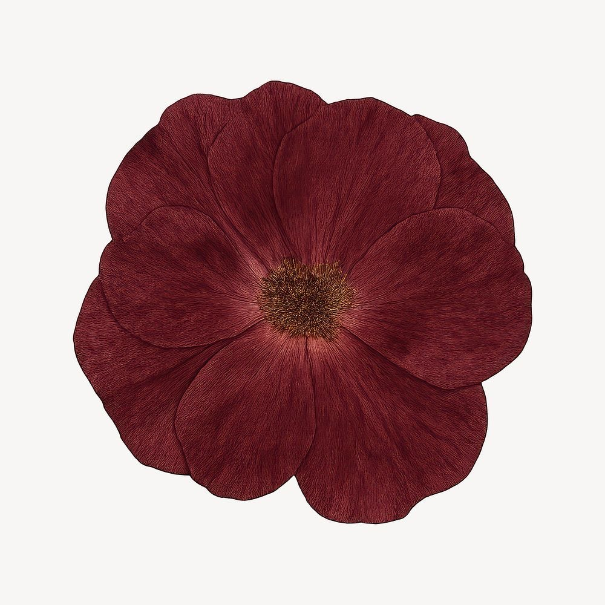
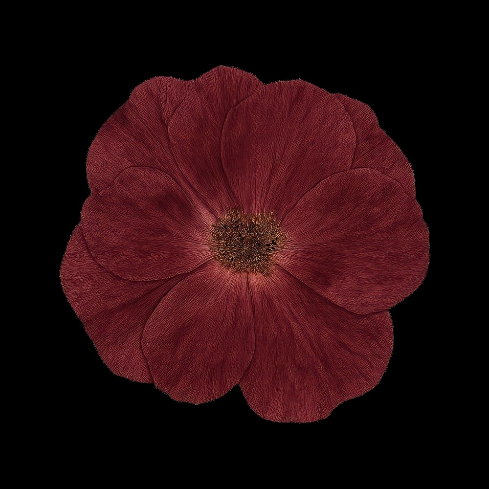

# 👩🏻‍💻 OpenCV Red Color Detection & Isolation System 👾

A Computer Vision pipeline engineered using Python 3 and the robust OpenCV library to programmatically detect, mask, and isolate specific color spectrums (Red shades) within a dynamic image environment utilizing the HSV (Hue, Saturation, Value) color matrix.

---

## 🌹 Color Detection Visual Analysis

Below is the verified graphical execution mapping showcasing the original image backdrop alongside the successfully processed and isolated red color channels:

| Original Reference Artifact | Extracted & Isolated Red Spectrum |
| :---: | :---: |
|  |  |

---

## ⚙️ Technical Architecture & Pipeline Logic

The underlying image processing framework executes through a structured mathematical multi-stage filter pattern:
1. **Color Plane Transition:** Converts the native BGR digital pixel matrix into the decoupled **HSV Color Space** to isolate color components from light intensity.
2. **Dual-Threshold Masking:** Implements exact lower and upper boundaries to map the red color spectrum spanning across both ends of the HSV circular hue scale:
   * Bound Matrix 1: `[0, 50, 40]` up to `[10, 25, 255]`
   * Bound Matrix 2: `[170, 50, 40]` up to `[180, 25, 255]`
3. **Bitwise Extraction Matrix:** Applies a bitwise logical `AND` mask overlay onto the original matrix structure, safely dropping all background non-red artifacts.

---

## 👥 Engineering Curation & Metadata

* **Lead Vision Engineer:** Eng. Fajr Al-Otaibi
* **Training Program:** Smart Methods Training Program
* **Core Technology Suite:** Python 3.x | OpenCV (`cv2`) | NumPy (`np`)
* **Status:** Verified Production Build & Fully Deployed 🚀🏆🏁
